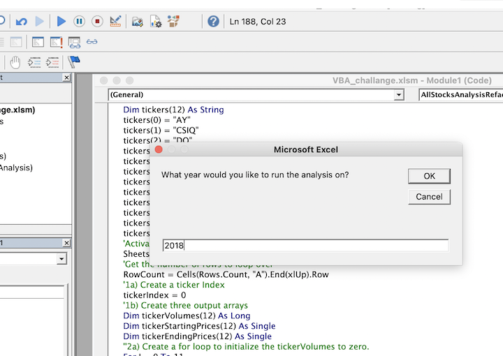

# Green Stock Analysis  
Steve, recent finance school graduate’s environmentally conscious parents see potential in alternative energy stocks and decided to invest their money into DAQO New Energy Corp **(DQ)** with no fundamental or technical evaluation. In order to help his parents Steve would like to do some research and seeking help analyzing dozen green energy stocks in Excel. 

After writing macros and refactoring it in VBA, Steve can analyze an entire dataset and visualize each company’s Total Daily Volume and Return by the year, at the click of a button.  
 

## Green Energy Stocks performance by year. 

 
 

Based on the Return shown above DAQO New Energy Corp **(DQ)** lost 62% which is a big factor to reconsider their investment decision. 

Refactoring makes the code more efficient and run faster—by taking fewer steps, using less memory, or improving the logic of the code to make it easier for future users to read. However, it is a time-consuming process. 

 

